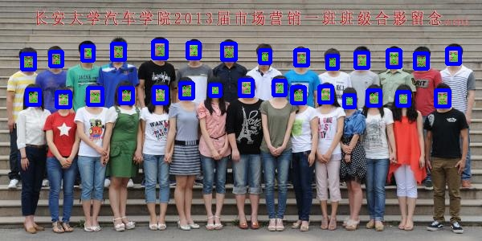
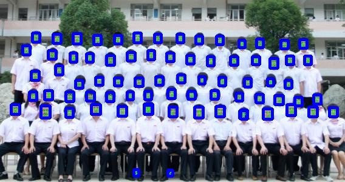
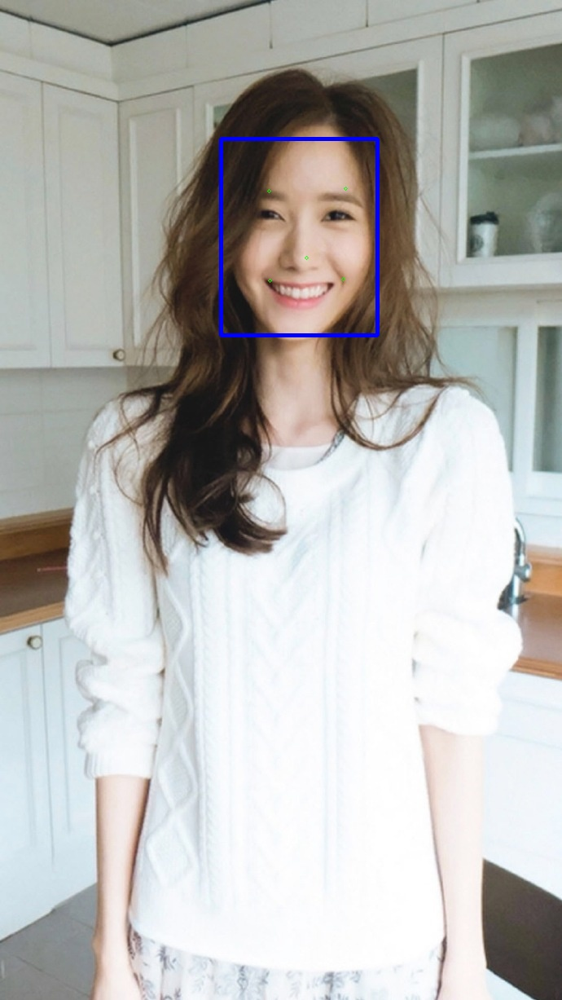

# MTCNN-tensorflow

* version 1.0稳定，version 2.0稳定，version 2.1更新中；

复现[Joint Face Detection and Alignment Using Multitask Cascaded Convolutional Networks](https://ieeexplore.ieee.org/stamp/stamp.jsp?tp=&arnumber=7553523)论文，参考了众多复现代码，在此附上链接并对表示感谢~

* https://github.com/kpzhang93/MTCNN_face_detection_alignment
* https://github.com/CongWeilin/mtcnn-caffe
* https://github.com/Seanlinx/mtcnn
* https://github.com/AITTSMD/MTCNN-Tensorflow

## 环境依赖

version1.0:

* Window10+GTX 1060+Python3.6+Anaconda5.2.0+Spyder+Tensorflow1.9-gpu

version2.0:

* ubuntu16.04+GTX 1080ti+Python3.6+Anaconda5.2.0+Tensorflow1.8-gpu

## 结果

>以下图片皆来源于网络，如有侵权，请联系本人删除。

## 总结

* 自己参考复现的MTCNN代码效果个人感觉一般，时间远没有达到论文中实时的地步。
* 测试阶段一张图片消耗时间主要取决于Pnet，Pnet效果一般导致大量的候选框nms消耗时间，Rnet与Onet速度很快。
* 召回率主要取决于threshold与min_face的取值，由于需要很高的召回率所以threshold取值很低，部分小人脸图片还需要调低min_face，导致了部分图片还是有误检，且运行时间偏慢。

## 其他

我的[CSDN博客](https://blog.csdn.net/Rrui7739/article/details/82084022)上有version 1.0的详细说明，欢迎大家指教~
